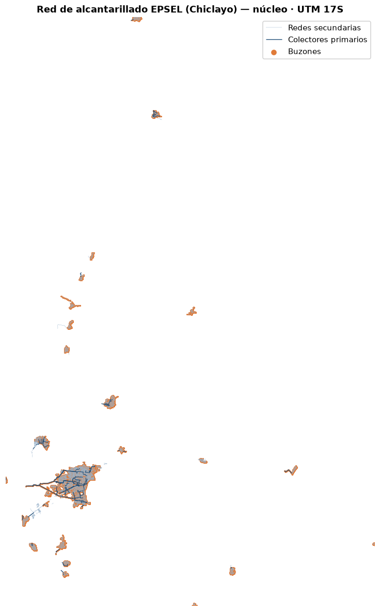
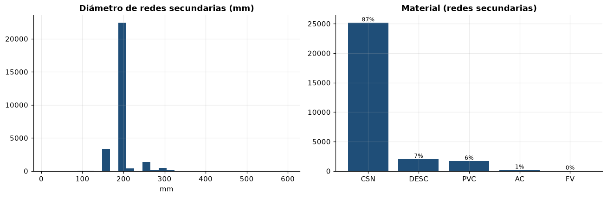
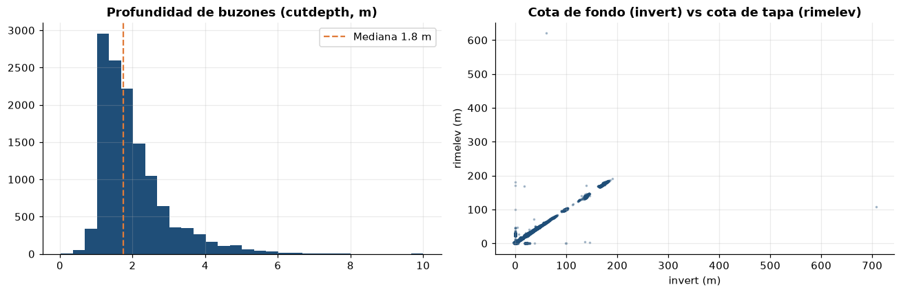
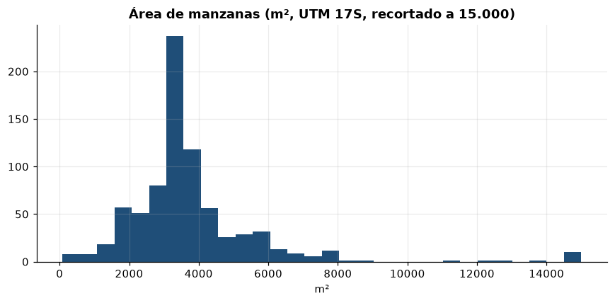
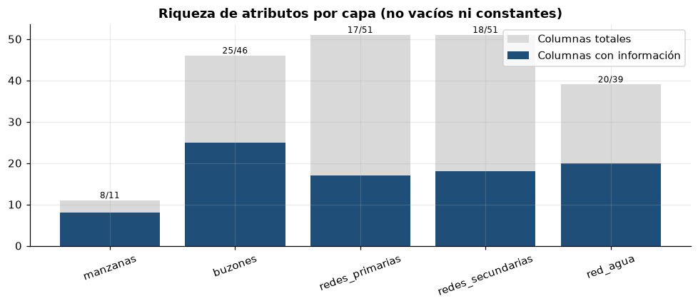

# EDA — Catastro técnico (capas GIS)

> Generado automáticamente por `scripts/03_eda_catastro.py`. Figuras en `reports/figures/catastro/`.
> Todas las capas se reproyectan a **UTM 17S (EPSG:32717)** para medir en metros.

## 1. Inventario de capas
| Capa | Registros | Geometría | CRS origen | Columnas con info / total |
|---|---|---|---|---|
| manzanas | 776 | Polígonos | EPSG:3857 | 8/11 |
| buzones | 21,354 | Puntos | EPSG:3857 | 25/46 |
| redes_primarias | 1,793 | Líneas | EPSG:3857 | 17/51 |
| redes_secundarias | 29,022 | Líneas | EPSG:3857 | 18/51 |
| red_agua | 25,403 | **SIN .shp** | EPSG:32717 (decl.) | 20/39 |

## 2. Red de alcantarillado integrada

- Manzanas + colectores primarios + redes secundarias + buzones, alineados en UTM 17S.
- ⚠️ **10 buzones** caen muy lejos del núcleo urbano (posibles errores de
  digitalización / coordenadas atípicas) → revisar antes de cálculos espaciales.

## 3. Atributos físicos de la red (redes secundarias)

- Material predominante: **CSN (87%)**.
- Diámetro mediano: **200 mm**.

## 4. Buzones: cota e hidráulica (clave para la topología)

- `invert` (cota de fondo) presente en **100.0%** y `flowdir` (dir. de flujo) en 94.4%.
- Profundidad mediana de excavación: **1.8 m**.
- Estas cotas permiten **reconstruir la topología y el sentido del flujo** del grafo de
  alcantarillado pese a que `frommh`/`tomh` vengan vacíos en las redes.

## 5. Manzanas (Sector 09)

- Área total ≈ **3.2 km²**, área mediana por manzana ≈ 3291 m².
- Solo se entregó el **Sector 09**; el catastro completo pesa ~350 GB.

## 6. Riqueza de atributos y calidad

- La mayoría de columnas del esquema ESRI vienen **vacías o constantes** ('Desconocido', 0).
- Campos de **antigüedad/fallas** (`installdat`, `condition`, `repairs`) vacíos o con
  placeholder (1900/1990) → **no sirven** para modelos de supervivencia de tuberías.
- `red_agua` solo tiene la **tabla .dbf** (sin geometría .shp): no se puede mapear ni
  analizar válvulas hasta recibir el shapefile. Su esquema es ArcGIS Utility Network
  (códigos numéricos en material/networktyp), distinto al de alcantarillado.
- 2 geometrías de redes secundarias son MultiLineString (revisar al construir el grafo).

## Conclusiones para el proyecto
1. **Viable hoy:** visualizar la red de alcantarillado (buzones + primarias + secundarias) y
   reconstruir el **grafo dirigido** usando geometría + cotas de buzón.
2. **Bloqueado:** red de agua (falta `.shp`) y todo modelo basado en antigüedad/condición.
3. **Acción de calidad:** depurar los buzones atípicos y unificar CRS a UTM 17S antes de cruzar con tickets.
