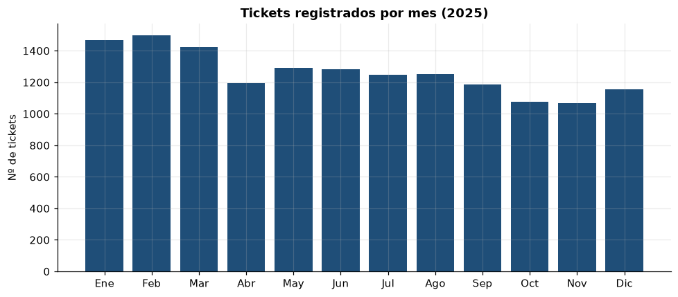
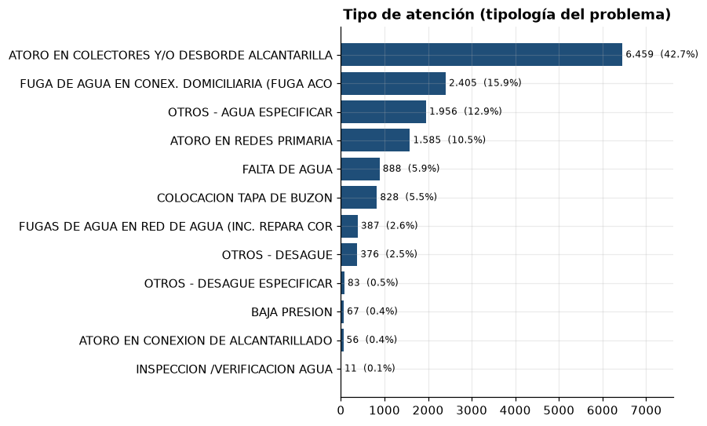
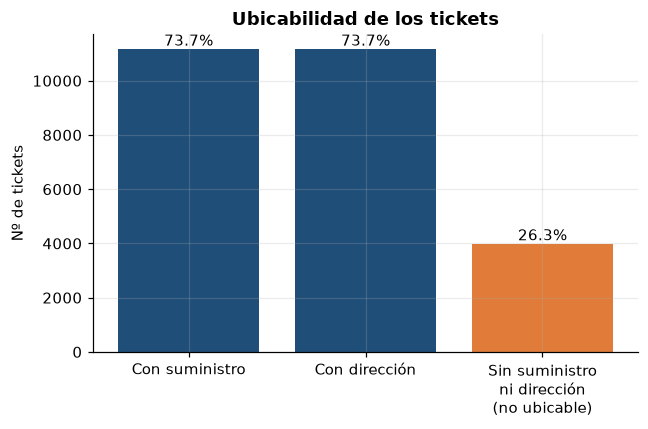
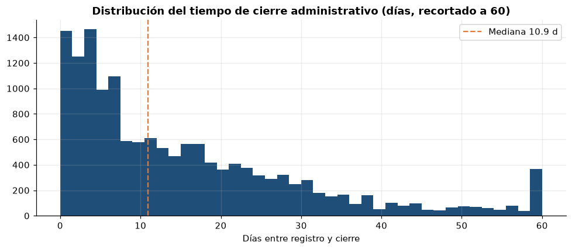
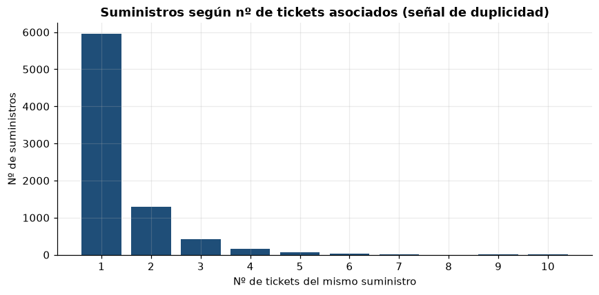

# EDA — Tickets DANA (reclamos operacionales)

> Generado automáticamente por `scripts/02_eda_tickets.py`. Figuras en `reports/figures/tickets/`.

## 1. Resumen
- **15,141 tickets**, periodo **2025-01-01 a 2025-12-31** (todos en estado *Finalizado*).
- Servicio: **DESAGÜE 62.2%** / AGUA 37.8%.
- Alcance: **general 77.7%** / particular 22.3%.
- Medio: **presencial 60.4%** / teléfono 38.7%.
- Concentración geográfica: **Chiclayo 95.0%** (21 distritos en total).

## 2. Estacionalidad y operación

- Mes pico: **Feb (1497)**; mes más bajo: Nov (1068).
- Patrón por día y hora de registro (oficina): ver `02_dia_hora.png`.

## 3. Tipología del problema

- Tipo dominante: **ATORO EN COLECTORES Y/O DESBORDE ALCANTARILLADO** (6,459 · 42.7%).
- Los **atoros** (colectores/redes/conexión) representan **53.5%** de todos los tickets.
- Composición agua/desagüe, alcance y medio: ver `04_composicion.png`.

## 4. Ubicabilidad (bloqueo crítico para mapear)

- Con código de **suministro**: **73.7%**; con **dirección**: 73.7%.
- **No ubicables** (sin suministro NI dirección): **3,982 (26.3%)**.
- ⚠️ El dataset **no tiene coordenadas**. La geolocalización depende de cruzar el
  `SUMINISTRO` contra el catastro comercial, o de geocodificar la dirección.

## 5. Tiempo de resolución (cierre administrativo)

- Mediana **10.9 días**, media 16.0, p90 35.6, máx 150.4.
- Por servicio: AGUA 16.9 d / DESAGÜE 7.5 d (mediana).
- Registros con duración negativa: 0.
- ⚠️ Es **cierre administrativo**, no el tiempo real de atención en campo.

## 6. Duplicidad de órdenes (oportunidad de deduplicación)

- De 7,957 suministros con ticket, **2,004 tienen más de uno**
  (hasta **11 tickets** en un mismo suministro).
- Colapsar los duplicados por suministro reduciría ~**21.1%** de los registros,
  confirmando el problema "una llamada = una orden".

## 7. Calidad de datos
- **Columnas constantes (sin valor analítico):** GRUPO, CATEGORÍA, ESTADO DEL TICKET.
- **Datos personales (PII):** PERSONA, DNI, CELULAR, TELEFONO FIJO, CORREO → tratar con cuidado / anonimizar.
- `DETALLE DE SOLUCIÓN`: 37.0% nulo y solo 65 valores distintos,
  mayormente "ATENDIDA" con muchos errores de tipeo → bajo valor sin normalización.
- `CORREO ELECTRÓNICO`: en la práctica es el correo del **operador**, no del ciudadano.

## Conclusiones para el proyecto
1. **Viable hoy:** dashboard tabular, análisis por tipo/servicio/distrito y **deduplicación** por suministro.
2. **Bloqueado:** mapa/heatmap y clustering hasta resolver coordenadas (cruce por SUMINISTRO es la vía más directa, cubre 73.7%).
3. Descartar del análisis las columnas constantes y normalizar/ignorar los campos de texto libre.
